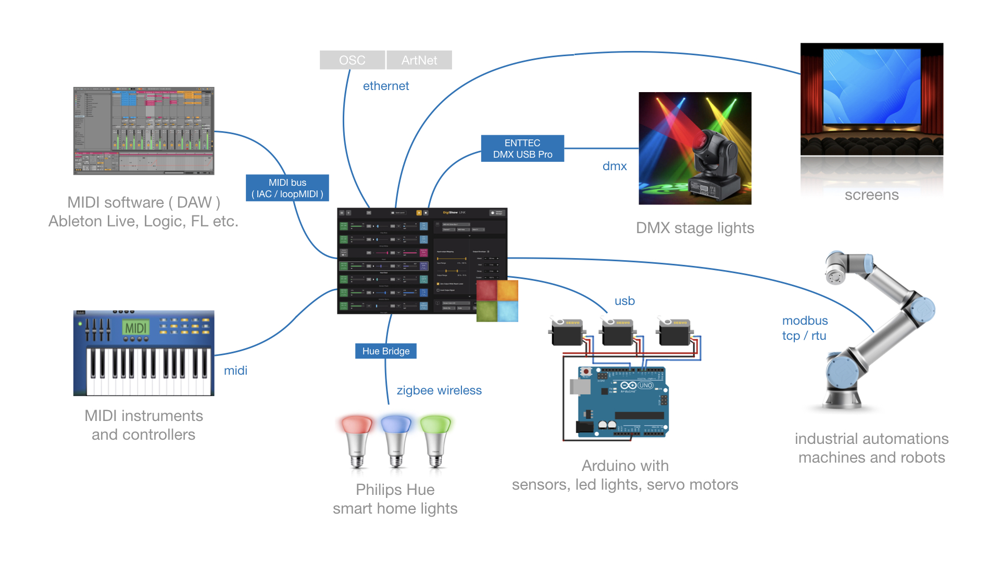
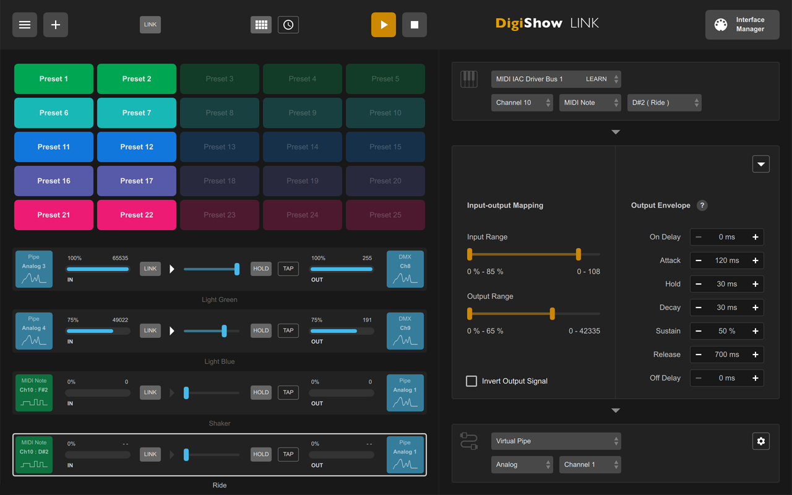
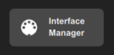
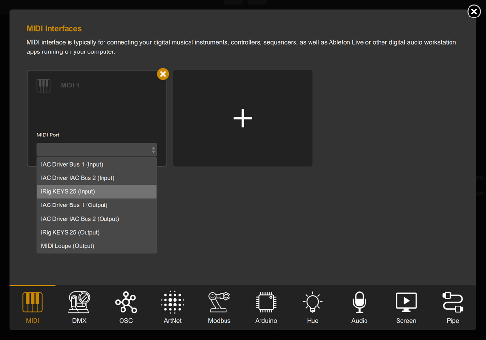
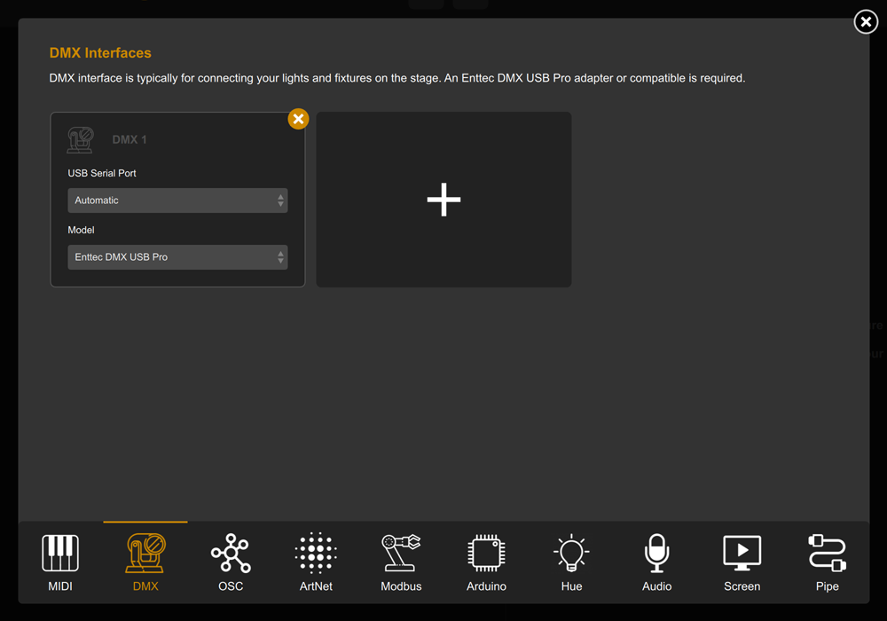
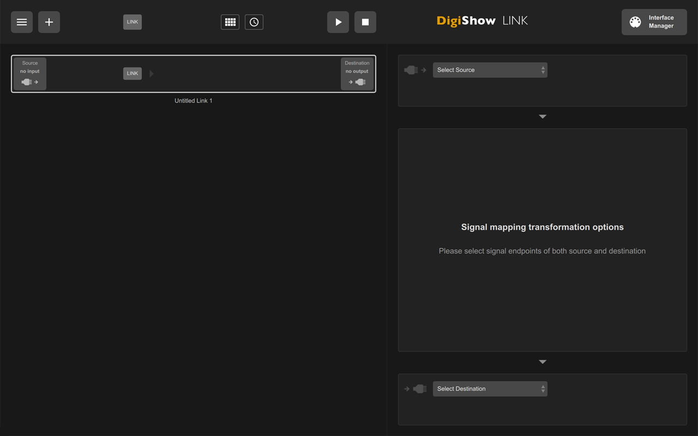
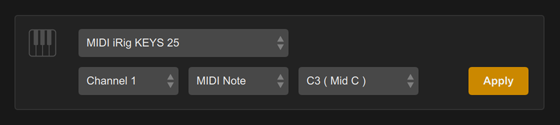
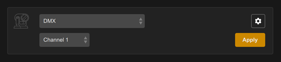
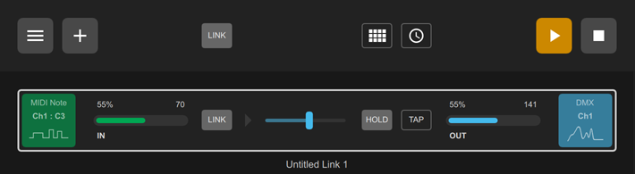
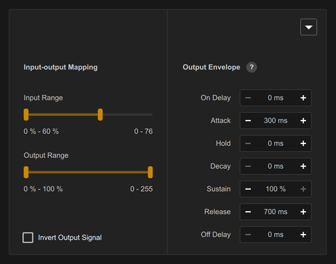

# DigiShow LINK  
  
[DOWNLOAD](https://github.com/robinz-labs/digishow/releases/latest)  
  
DigiShow is a lightweight control software designed for live performances and immersive show spaces with music, lights, displays, robots and interactive installations. It serves as an easy-to-use console for signal controlling, also enables signal mapping between MIDI, DMX, OSC, ArtNet, Modbus, Arduino, Philips Hue and more digital interfaces. 

With using DigiShow LINK app, there are some scenarios assumed: 

**Producers:** 
For live music or theatre performances, DJ or producers can arrange show lighting cues and stage automations on MIDI tracks alongside the music tracks in Ableton Live or other DAW. At the show, press the button on the Launchpad, the music loop and lighting effects will be instantly played in sync. 

**Performers:** 
When playing MIDI instruments like drums or keyboards, DigiShow can trigger dynamic lighting changes and even robotic movements by MIDI notes following the beat or the music. Sensors can also be added to acoustic or DIY instruments to automatically generate MIDI notes.

**Artists and Designer:**
For building interactive art installations, the creators often need to make software that works with the hardware. DigiShow provides OSC, ArtNet, WebSocket pipes for inter-application communication. Designers can create their interactive content in some creative software like TouchDesigner, Unity 3D, P5.js and access the hardware easily through DigiShow. Developers can also program using Python or JavaScript to connect DigiShow and extend interaction logic. 

**Makers and Hobbyists:**
DigiShow is for all show makers as well as hobbyists with little professional skills. Make digital shows for your own party time, or just make your house into a mini 'disneyland'.

Watch Video https://www.youtube.com/channel/UCmswlPRHZ5FhZIxTHJWqj7w  

## How does DigiShow work?

For a typical 'digital' show, requires some particular digital things working together, along with DigiShow LINK. 

DigiShow LINK app enables signal mapping and transferring between MIDI and other digital device interfaces like DMX, ArtNet, OSC, Modbus, Arduino, Philips Hue, as well as controls for interactive media presentation on screens. 

MIDI notes and MIDI control changes are mapped and transformed to the signals for light, servo, media and more controls. Also, some input signals from sensors can be converted to MIDI notes or CC that will be able to be processed by other digital music software. 

DigiShow LINK works well with any music software that supports MIDI input/output, like Ableton Live, Logic Pro, etc. Light, media and other show cues can be flexibly arranged on MIDI tracks with notes and CC automation.

## Supported Interfaces

- **MIDI** interface is typically for connecting your digital musical instruments, controllers, sequencers and digital music apps.
- **DMX** interface is typically for connecting your lights and fixtures on the stage.
- **OSC** interface is typically for connecting your interactive media control and creation applications.
- **ArtNet** interface is typically for connecting your show lights through an IP network.
- **Modbus** interface is typically for connecting your industrial automations, robots and machines.
- **Arduino** is an open source electronic controller for making homebrew instruments, lights or gadgets for your interactive shows.
- **Philips Hue** is the popular smart home wireless-controlled lights.
- DigiShow can also control presenting videos, pictures and web content with dynamic effects on multiple screens.  

## App Features

**Controller**  
DigiShow LINK app provides a simple user interface, with which you can easily configure the communication interfaces of various devices, and complete the patching of various input and output signals. 

**Console**  
The most basic user interface of the app looks like a standalone console, which can be used to adjust output signals instantly by moving faders and view input signal changes in real-time meters. 

**Signal Mapping**  
The primary function designed in the app is a signal hub that works with digital show facilities, it provides an efficient configuration method for signal mapping and conversion. Typically, DigiShow LINK runs on the computer as a service responsible for connecting hardware devices and some other software that manages respective show content and executes the show logic. The show is done in cooperation of all hardware and software coordinated by DigiShow. 

## Release Downloads

Please visit https://github.com/robinz-labs/digishow/releases/latest to download the latest releases:  
- DigiShow LINK for windows (64bit / intel)
- DigiShow LINK for macOS (64bit / intel)
- DigiShow LINK for macOS (64bit / apple silicon)

Go to the page, where choose digishow_win_x.x.x_x64.zip, digishow_mac_x.x.x_x64.zip or digishow_mac_x.x.x_arm64.zip in Assets list to download. 

## Install and Run

Download and unzip the latest release file.  

**macOS:**  
Copy app "DigiShow" to your Applications folder and run it. 

If you see the error message says **DigiShow app is damaged and can’t be opened**, please also need to run the command _xattr -cr /Applications/DigiShow.app_ in the terminal before starting the app for the first time. 

**Windows:**  
Copy folder "DigiShow LINK" to your disk and run "DigiShow.exe" in the folder. 

If you see the error message says **The code execution cannot proceed because MSVCP140.dll was not found**, please also need to run Extra\vc_redist.x64.exe to install Visual C++ Redistributable to your windows system. 

It's also recommended to install loopMIDI and K-Lite Codec Pack to your Windows, the installer files can be found in Extra folder. 

## Extra Downloads and Resources

**MIDI** virtual MIDI bus drivers (IAC / loopMIDI)  
In order to communicate with MIDI messages between DigiShow LINK and other software, users just need to setup a virtual MIDI bus in the operation system.  
[learn IAC for Mac](https://help.ableton.com/hc/en-us/articles/209774225-How-to-setup-a-virtual-MIDI-bus)  
[download loopMIDI for Windows](http://www.tobias-erichsen.de/software/loopmidi.html)  

**DMX** ENTTEC DMX USB Pro driver (FTDI VCP)  
Required to enable DigiShow LINK to control DMX lightings through an ENTTEC adapter.  
[download](https://www.ftdichip.com/Drivers/VCP.htm) 

**Arduino** sketch for Arduino remote IO controls  
Required to enable DigiShow LINK to configure and control IO on your Arduino units remotely.  
[download](https://github.com/robinz-labs/rioc-arduino/releases) 

**Screen** K-Lite Codec Pack (for windows)  
Required to enable DigiShow LINK to play MP4, MOV video files on your Windows computer.  
[download](https://www.codecguide.com/download_kl.htm) 

## Get Started with DigiShow

1. Let's try to use DigiShow for the first time. Connect a MIDI keyboard and an ENTTEC DMX USB Pro adapter to the USB ports of your computer. ENTTEC adapter is used to connect DMX lights. 

2. Open the DigiShow LINK app, and click 'Interface Manager' button in the upper right corner of the window. 

Interface Manager dialog box appears, select the MIDI tab item and click the + button to create a new interface section labeled 'MIDI 1', where select your MIDI keyboard model. 

Select the DMX tab item and click the + button to create a new interface section labeled 'DMX 1'. Close the Interface Manager dialog when finished all. 

3. Now let's try to create a signal link to connect your MIDI keyboard input with the DMX light output, click the + button in the upper left corner of the window, a blank link item will be added to the left list. Alongside, you need to set the input source, output destination and mapping transformation parameters for the signal link on the right. 

4. Click the 'Select Source' drop-down menu, select your MIDI keyboard in it, and set the input parameters to 'Channel 1' 'MIDI Note' 'C3', and click the Apply button. 

Click the 'Select Destination' drop-down menu, select DMX in it, set the output parameter to 'Channel 1', and click the Apply button. 

5. Click the ▶︎ button in top bar to start the signal link session. At this point, when you press C3 (Middle C) on the MIDI keyboard, the lighting changes in DMX channel 1 will be trigged synchronously. 

6. Modify the settings in 'Input-out Mapping' and 'Output Envelope' to change the effect of the mapping transformation in real time. For example, setting 'Attack' to 300ms and 'Release' to 700ms makes the lighting fade in and out. 

7. And, add more signal links in this way. 

 
## Developer Resources

DigiShow is open-source. If you would like to rebuild this software using the source code we contributed, please visit https://github.com/robinz-labs/ . 

Please use qmake tool or QtCreator app to build executables from the source code, and confirm these library dependencies are required: 
- Qt 5.12 or 5.15 LTS http://www.qt.io
- RtMidi 4.0.0 http://www.music.mcgill.ca/~gary/rtmidi/
- TinyOSC library https://github.com/mhroth/tinyosc
- Ableton Link library https://ableton.github.io/link/
- global hotkey library https://github.com/Skycoder42/QHotkey

The source code can be compiled for target platforms compatible with: 
- macOS 10.13 or higher
- windows 10 or windows 11 ( 64-bit version )
- linux ( see the websites of Qt and other dependent libraries for compatibility details )
