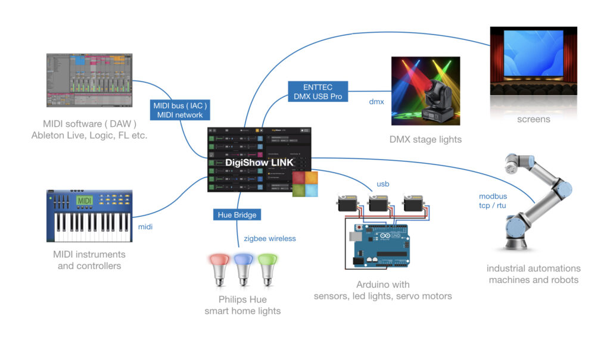

# DigiShow LINK
DigiShow is an easy-to-use software aims at controls for live performances and interactive shows with music, lights, displays, machines, robots and more digital things. 

With using DigiShow LINK app, there are some possible scenarios: A DJ can arrange cue actions in Ableton Live and control automations on the stage. A drummer can play dynamic show lightings following the drum beats. An experimental musician can make and play own DIY instruments. An artist can create new art works with more interactive media elements. Also, DigiShow is for everybody. With it plus a little creativity, you can inject your magical moments into the party time with your friends and family. 

DigiShow LINK app enables signal transferring between MIDI and other digital device interfaces like DMX, ArtNet, Modbus, Arduino, Philips Hue, as well as controls for media presentation on screens. MIDI notes and MIDI control changes are mapped and transformed to the signals for light, servo, media and more controls. Also, some input signals from sensors can be converted to MIDI notes or CC that will be able to be processed by other digital music software. 

DigiShow LINK works well with other music software that supports MIDI input/output, like Ableton Live, Logic Pro, FL Studio, etc. We can arrange light, media and other actions on MIDI tracks with notes and CC automations. However, DigiShow is an independent app rather than a plugin. In order to communicate with MIDI messages between LINK and other software, users just need to setup a virtual MIDI bus on their computers. 

- MIDI interface is typically for connecting your digital musical instruments, controllers, sequencers and digital music apps.
- DMX interface is typically for connecting your lights and fixtures on the stage.
- ArtNet interface is typically for connecting your show lights through an IP network.
- Modbus interface is typically for connecting your industrial automations, robots and machines.
- Arduino is an open source electronic controller for making homebrew instruments, lights or gadgets for your interactive shows.
- Philips Hue is the popular smart home wireless-controlled lights.
- DigiShow can also control presenting videos, pictures and web contents with dynamic effects on multiple screens.

DigiShow makes all these digital things work together for your amazing show time, enjoys !! 

## Official release downloads
Please visit http://robinz.org/labs/digishow to download the latest releases: 
- DigiShow LINK for macOS (64bit)
- DigiShow LINK for windows (64bit)

## Install and run DigiShow LINK apps
Download and unzip the latest release file.  

macOS:  
Copy app "DigiShow" to your Applications folder and run it.  

Windows:  
Run Extra\vc_redist.x64.exe to install Visual C++ 2015 Redistributable to your windows system.  
Copy folder "DigiShow LINK" to your disk and run "DigiShow.exe" in the folder.  

## Extra downloads and resources
[ Arduino ] sketch for Arduino remote IO controls  
Required to enable DigiShow LINK to configure and control IO on your Arduino units remotely.  
[download](https://github.com/robinz-labs/rioc-arduino/releases) 

[ DMX ] ENTTEC DMX USB Pro driver (FTDI VCP)  
Required to enable DigiShow LINK to control DMX lightings through an ENTTEC adapter.  
[download](https://www.ftdichip.com/Drivers/VCP.htm) 

[ MIDI ] virtual MIDI bus drivers (IAC for Mac / loopMIDI for Windows)  
Required to enable DigiShow LINK to communicate with other MIDI apps running on a same computer.  
[learn](https://help.ableton.com/hc/en-us/articles/209774225-How-to-setup-a-virtual-MIDI-bus) 
 
[ MIDI ] virtual MIDI network drivers (MIDI network for Mac / rtpMIDI for Windows)  
Required to enable DigiShow LINK to communicate with other MIDI apps running on different computers.  
[learn](https://help.ableton.com/hc/en-us/articles/209071169-How-to-setup-a-virtual-MIDI-network) 

[ MIDI ] MIDI signal monitor  
A utility that is helpful to understand MIDI Note, CC signals transferring between your MIDI devices and apps.  
[learn](https://support.native-instruments.com/hc/en-us/articles/209544729-How-to-Monitor-the-Input-of-a-MIDI-Controller) 
 
## Developer resources
DigiShow is open-source. If you would like to rebuild this software using the source code we contributed, please visit https://github.com/robinz-labs/ . 

Please use qmake tool or QtCreator app to build executables from the source code, and confirm these library dependencies are required: 
- Qt 5.12 or higher http://www.qt.io
- RtMidi 4.0.0 http://www.music.mcgill.ca/~gary/rtmidi/

The source code can be compiled for target platforms compatible with: 
- macOS 10.13 or higher
- windows 7, windows 10 or higher ( 64-bit version recommended )
- linux ( see Qt and RtMidi websites for compatibility details )
