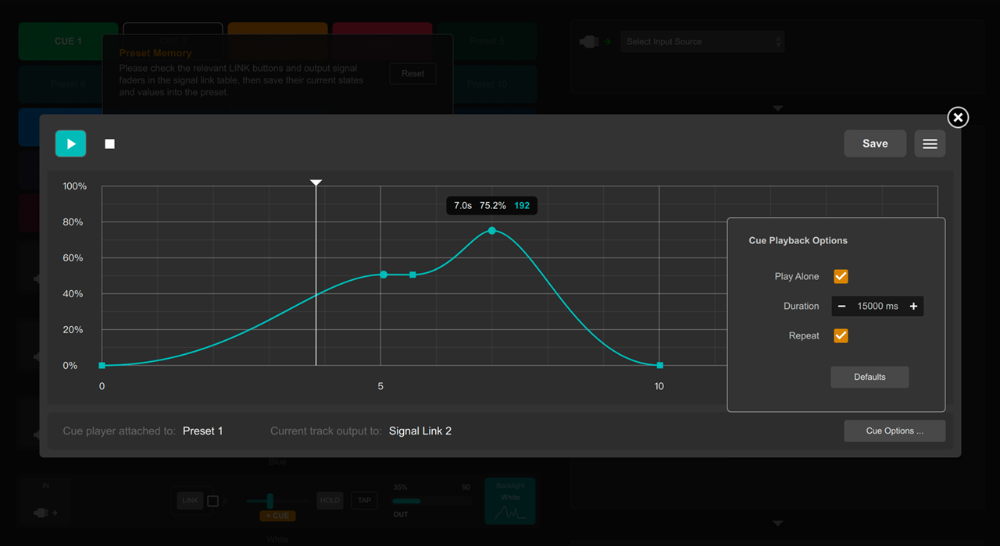

# DigiShow LINK  
  
[DOWNLOAD](https://github.com/robinz-labs/digishow/releases/latest) | [TUTORIALS](https://github.com/robinz-labs/digishow/blob/master/guides/tutorials.md) 
  
DigiShow is a lightweight cross-media control software designed for live performances and interactive art installations. It provides an intuitive console interface that enables signal control and mapping among various audio, lighting, robotic, and interactive devices. 

- **Digital Artists:** Create cross-media interactive art installations 
- **Stage & Immersive Designers:** Program cues to synchronize lighting, mechanical devices, and music 
- **Musicians:** Enhance live performances with DIY electronic instruments or automated lighting 
- **Engineers & Makers:** Develop smart interactive projects like home automations 


## Key Features

- **Multi-Protocol Support** 

	Supports MIDI, DMX, OSC, Modbus, Arduino, Hue, and other protocols for coordinated control of audio, lighting, screens, robotics, and more. 

- **Signal Mapping**

	Converts MIDI notes, OSC control signals, etc., into lighting, servo motor, and media playback commands. Also transforms sensor inputs into MIDI/OSC signals for music software (e.g., Ableton Live, Logic Pro) and real-time visual creative tools (e.g., TouchDesigner, Unreal Engine). 

- **Interactive Control** 

	Ideal for DJ performances, stage or space lighting synchronization, experimental music, and interactive installations to enhance live engagement and visual effects. 

For a typical 'digital' show, requires some particular digital things working together, along with DigiShow LINK. 


## Technologies and Functions

- **No-Coding Arduino** 

	Provides a ready-to-use sketch drives mapping sensors and actuators connected to Arduino as inputs and outputs used directly in the DigiShow. 

- **Cue Player** 

	Features a graphical interface for designing output curves for specific scenarios, which can be attached to presets for synchronized playback. 

- **Pixel Mapping** 

	Dynamically maps video or image pixels to lighting arrays for visual effects. 

- **Scripting Support** 

	Allows JavaScript/QML expressions and scripts for advanced interactive logic. 

- **Network Protocols** 

	Supports OSC and pipes over WebSocket for external extensions, as well as Art-Net for large-scale lighting control systems. 


## Screenshots

  
DigiShow main window: preset launcher, signal link table and signal mapping settings. 
 
  
Timeline Editor for Cue Player: design the output signal playback curve in the timeline. 

[DEMO VIDEO](https://www.youtube.com/@robinzlabs6390) 


## DigiShow for Beginners

1. **Configure Interfaces:** 

	Set up control interfaces (e.g., MIDI, DMX, Arduino) for audio, lighting, and interactive devices in the Interface Manager. 

2. **Create Signal Links:** 

	Add signal bars in the Signal Link Table and assign specific outputs to them, where adjust output values in real time using faders. 

3. **Save Scenes:** 

	Save output values in the grouped signal bars as Presets for specific scenarios. Store timeline-based signal output curves in the Cue Player. 

4. **Switch Scenes (Manual):** 

	Activate the saved Presets and Cue Players by tapping the buttons in the Preset Launcher or a remote web page in another smart phone. 

5. **Trigger Scenes (Automatic):** 

	Alternatively, connects scene switching to specific sensor triggers, by selecting the sensors as inputs and Presets as outputs in the signal bars. 

With these steps, you can build a live audio-visual control console or an interactive art installation. 

[READ DETAILS](https://github.com/robinz-labs/digishow/blob/master/guides/beginner.md) 
 

## Release Downloads

Please visit https://github.com/robinz-labs/digishow/releases/latest to download the latest releases:  
- DigiShow LINK for windows (64bit / intel)
- DigiShow LINK for macOS (64bit / intel)
- DigiShow LINK for macOS (64bit / apple M series)

Go to the page, where choose digishow_win_x.x.x_x64.zip, digishow_mac_x.x.x_x64.zip or digishow_mac_x.x.x_arm64.zip in Assets list to download. 


## Install and Run

Download and unzip the latest release file.  

**macOS:**  
Copy app "DigiShow" to your Applications folder and run it. 

If you see the error message says **DigiShow app is damaged and can’t be opened**, please also need to run this command in the terminal before starting the app for the first time. 
```bash
xattr -cr /Applications/DigiShow.app
```

**Windows:**  
Copy folder "DigiShow LINK" to your disk and run "DigiShow.exe" in the folder. 

If you see the error message says **The code execution cannot proceed because MSVCP140.dll was not found**, please also need to run Extra\vc_redist.x64.exe to install Visual C++ Redistributable to your windows system. 

It's also recommended to install loopMIDI and K-Lite Codec Pack to your Windows, the installer files can be found in Extra folder. 


## Extra Downloads and Resources

- **Arduino** DigiShow RIOC library 

	Required to enable DigiShow LINK app to control sensors and actuators connected on your Arduino.  
	Find and install DigiShow RIOC in the library manager of Arduino IDE, or download it from github.  
	[download](https://github.com/robinz-labs/rioc-arduino/releases) 

- **MIDI** virtual MIDI bus drivers (IAC / loopMIDI) 

	In order to communicate with MIDI messages between DigiShow LINK and other software, users just need to setup a virtual MIDI bus in the operation system.  
	[learn IAC for Mac](https://help.ableton.com/hc/en-us/articles/209774225-How-to-setup-a-virtual-MIDI-bus)  
	[download loopMIDI for Windows](http://www.tobias-erichsen.de/software/loopmidi.html)  

- **DMX** ENTTEC DMX USB Pro driver (FTDI VCP) 

	Required to enable DigiShow LINK to control DMX lightings through an ENTTEC adapter.  
	[download](https://www.ftdichip.com/Drivers/VCP.htm) 

- **Screen** K-Lite Codec Pack (for windows) 

	Required to enable DigiShow LINK to play MP4, MOV video files on your Windows computer.  
	[download](https://www.codecguide.com/download_kl.htm) 


## Developer Resources

DigiShow is open-source. If you would like to rebuild this software using the source code we contributed, please visit https://github.com/robinz-labs/digishow . 

Building executables from source using the qmake tool or the QtCreator application requires Qt 5.12 or 5.15 LTS. 

Additional library dependencies are already included in the repository: 

- RtMidi 4.0.0 http://www.music.mcgill.ca/~gary/rtmidi/
- TinyOSC library https://github.com/mhroth/tinyosc/
- Ableton Link library https://ableton.github.io/link/
- global hotkey library https://github.com/Skycoder42/QHotkey/
- qt-qrcode https://github.com/danielsanfr/qt-qrcode/
- libFTDI https://www.intra2net.com/en/developer/libftdi/

The source code can be compiled for target platforms compatible with: 

- macOS 10.13 or later
- Windows 10 or Windows 11 (64-bit version)
- Linux (tested on ARM 64-bit platforms such as Raspberry Pi 5)
