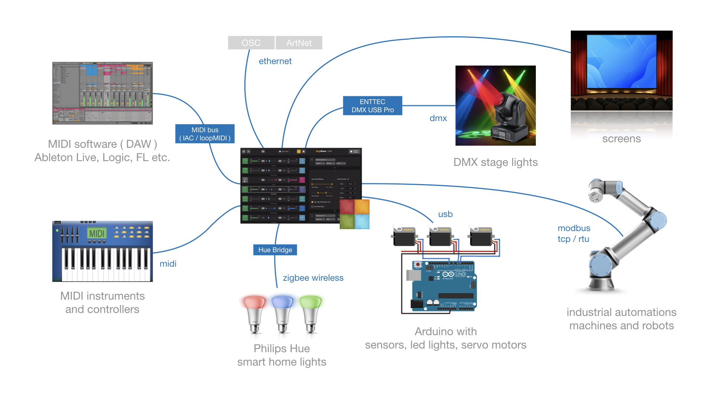
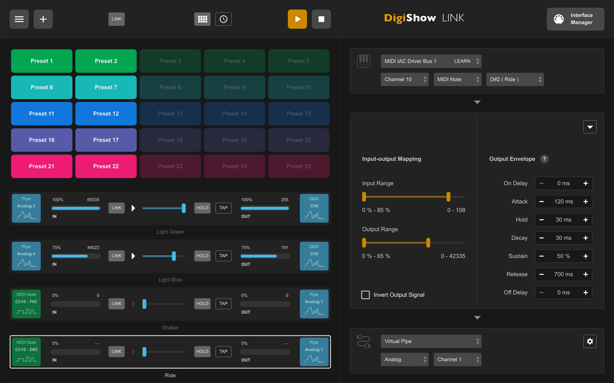
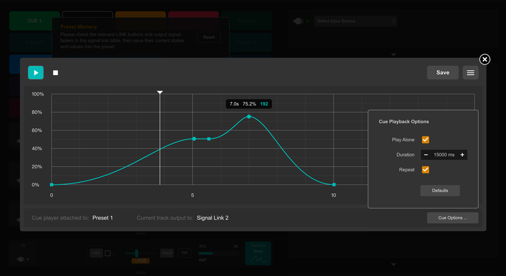

# DigiShow LINK  

[下载](https://github.com/robinz-labs/digishow/releases/latest) | [教程](https://github.com/robinz-labs/digishow/blob/master/guides/tutorials.md) |  [YOUTUBE](https://www.youtube.com/watch?v=XFE75XyCr3k)

DigiShow 是一款专为现场演出和互动艺术装置设计的轻量级跨媒体控制软件。它提供了直观的控制台界面，支持各类音频、灯光、机械装置及互动设备之间的信号控制与映射。

- **数字艺术家：** 创作跨媒体互动艺术装置  
- **舞台及沉浸式体验设计师：** 编排Cue(场景)，实现灯光、机械装置与音乐的同步  
- **音乐人：** 通过 DIY 电子乐器或自动化灯光增强现场演出效果  
- **工程师与创客：** 开发智能互动项目，如家庭自动化系统  


## 核心特性

- **多协议支持**  

	支持 MIDI、DMX、OSC、Modbus、Arduino、Hue 等协议，实现对音频、灯光、屏幕、机械装置等的协调控制。

- **信号映射**  

	将 MIDI 音符、OSC 控制信号等转换为灯光、伺服电机及媒体播放指令；同时可将传感器输入转换为 MIDI/OSC 信号，用于音乐软件（如 Ableton Live、Logic Pro）及实时视觉创作工具（如 TouchDesigner、Unreal Engine）。

- **互动控制**  

	适用于 DJ 演出、舞台或空间灯光同步、实验音乐及互动装置，增强现场互动性与视觉效果。

对于一个典型的“数字”演出，需要多种特定数字设备协同工作，配合 DigiShow LINK 一起使用。




## 技术与功能

- **无需编程的 Arduino**  

	提供开箱即用的 Arduino 程序，驱动连接在 Arduino 上的传感器和执行器，作为 DigiShow 中直接使用的输入和输出。

- **Cue 播放器**  

	提供图形化界面，可为特定场景设计输出曲线，并可附加到预设中实现同步播放。

- **像素映射**  

	将视频或图像像素动态映射到灯光阵列上，实现视觉效果。

- **脚本支持**  

	允许使用 JavaScript/QML 表达式和脚本，实现高级互动逻辑。

- **网络协议**  

	支持 OSC 及基于 WebSocket 的管道用于外部扩展，同时支持 Art-Net 用于大型灯光控制系统。


## 截图

  
DigiShow 主窗口：预设启动器、信号链接表及信号映射设置。

  
Cue播放器的时间轴编辑器：在时间轴上设计输出信号播放曲线。


## 示例

为了更好理解 DigiShow 的特点和功能，请在 examples 目录中使用安装好的 DigiShow 应用程序来打开各个 .dgs 示例工程：

1. **basic** 

	适合初学者的一组示例，涵盖：键盘热键、虚拟管道、预设、Cue（场景）、信号映射（如 MIDI 映射）等基础概念。 

2. **audio player** 

	一组有趣的示例，来说明如何用好音频播放器接口。 

3. **playback control** 

	理解“播控”是学习如何设计交互系统的一个很好的路径，我们提供了一系列渐进的示例。 

4. **presets and beats** 

	“预设启动器”和“节拍生成器”是 DigiShow 的重要组件，我们用一系列渐进的灯光控台示例来演示它们的作用。 

5. **audio input** 

	了解如何通过“音频输入”接口连接麦克风或拾音器，来获得声音强度（或震动强度）。 

6. **dmx** 

	使用 DMX 和 ArtNet 来控制灯光，提供了512通道测试程序和像素映射示例。 

7. **screen** 

	在 DigiShow 的“屏幕”接口中动态展示图片或播放视频。 

8. **osc** 

	DigiShow 中的信号变量可以透过 OSC 与外部软件进行实时交换，示例涵盖：TouchDesigner、Unity3D、Blender 以及 Python（可对接 AI 智能体） 

9. **web app** 

	编写能与 DigiShow 一起工作的 web app，特别适合 AI 智能体 vibe coding。 

10. **remote pipe** 
	
	解释如何运用远程虚拟管道打通两个 DigiShow 实例之间的信号同步。还有 DigiShow 与 网页、Python 程序中的 WebSocket 客户端进行通信的方式。 

11. **javascript** 

	在 DigiShow 中使用 JavaScript 表达式和脚本来实现更多智能逻辑。 

12. **ableton** 

	DigiShow 与 Ableton Live 一起使用来制作音乐装置的完整演示。 

13. **wireless** 
	
	构建能无线连接 DigiShow 的互动小设备（使用 ESP32 Arduino 的 Wifi 和 蓝牙）。
	

## 发布版本下载

请访问 https://github.com/robinz-labs/digishow/releases/latest 下载最新版本：  
- 适用于 Windows 的 DigiShow LINK（64位 / intel）
- 适用于 macOS 的 DigiShow LINK（64位 / intel）
- 适用于 macOS 的 DigiShow LINK（64位 / apple M 系列）

进入页面后，在 Assets 列表中选择下载 digishow_win_x.x.x_x64.zip、digishow_mac_x.x.x_x64.zip 或 digishow_mac_x.x.x_arm64.zip。


## 安装与运行

下载并解压最新版本文件。

**macOS：**  
将应用“DigiShow”复制到 Applications 文件夹并运行。

如果看到错误提示 **DigiShow app is damaged and can’t be opened**，请在首次启动前在终端中运行以下命令：
```bash
xattr -cr /Applications/DigiShow.app
```

**Windows：**  
将“DigiShow LINK”文件夹复制到磁盘，然后运行文件夹中的“DigiShow.exe”。

如果看到错误提示 **The code execution cannot proceed because MSVCP140.dll was not found**，请运行 Extra\vc_redist.x64.exe 将 Visual C++ Redistributable 安装到 Windows 系统中。

此外，建议在 Windows 上安装 loopMIDI 和 K-Lite Codec Pack，安装程序文件可在 Extra 文件夹中找到。


## 额外下载与资源

- **Arduino** DigiShow RIOC 库  

	使 DigiShow LINK 应用能够控制连接在 Arduino 上的传感器和执行器。  
	在 Arduino IDE 的库管理器中查找并安装 DigiShow RIOC，或从 github 下载。  
	[下载](https://github.com/robinz-labs/rioc-arduino/releases)

- **MIDI** 虚拟 MIDI 总线驱动程序（IAC / loopMIDI）  

	为了在 DigiShow LINK 与其他软件之间通过 MIDI 消息进行通信，用户只需在操作系统中设置一个虚拟 MIDI 总线。  
	[了解 Mac 的 IAC](https://help.ableton.com/hc/en-us/articles/209774225-How-to-setup-a-virtual-MIDI-bus)  
	[下载 Windows 版 loopMIDI](http://www.tobias-erichsen.de/software/loopmidi.html)

- **DMX** ENTTEC DMX USB Pro 驱动程序（FTDI VCP）  

	使 DigiShow LINK 能够通过 ENTTEC 适配器控制 DMX 灯光。  
	[下载](https://www.ftdichip.com/Drivers/VCP.htm)

- **屏幕** K-Lite Codec Pack（适用于 Windows）  

	使 DigiShow LINK 能够在 Windows 计算机上播放 MP4、MOV 视频文件。  
	[下载](https://www.codecguide.com/download_kl.htm)


## 开发者资源

DigiShow 是开源的。如果您想使用我们贡献的源代码重新构建此软件，请访问 https://github.com/robinz-labs/digishow。

使用 qmake 工具或 QtCreator 应用程序从源代码构建可执行文件需要 Qt 5.12 或 5.15 LTS。

仓库中已包含额外的库依赖：

- RtMidi 4.0.0 http://www.music.mcgill.ca/~gary/rtmidi/
- TinyOSC 库 https://github.com/mhroth/tinyosc/
- Ableton Link 库 https://ableton.github.io/link/
- global hotkey 库 https://github.com/Skycoder42/QHotkey/
- qt-qrcode https://github.com/danielsanfr/qt-qrcode/
- libFTDI https://www.intra2net.com/en/developer/libftdi/

源代码可编译为兼容以下目标平台：

- macOS 10.13 或更高版本
- Windows 10 或 Windows 11（64 位版本）
- Linux（已在 Raspberry Pi 5 等 ARM 64 位平台上测试）