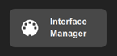
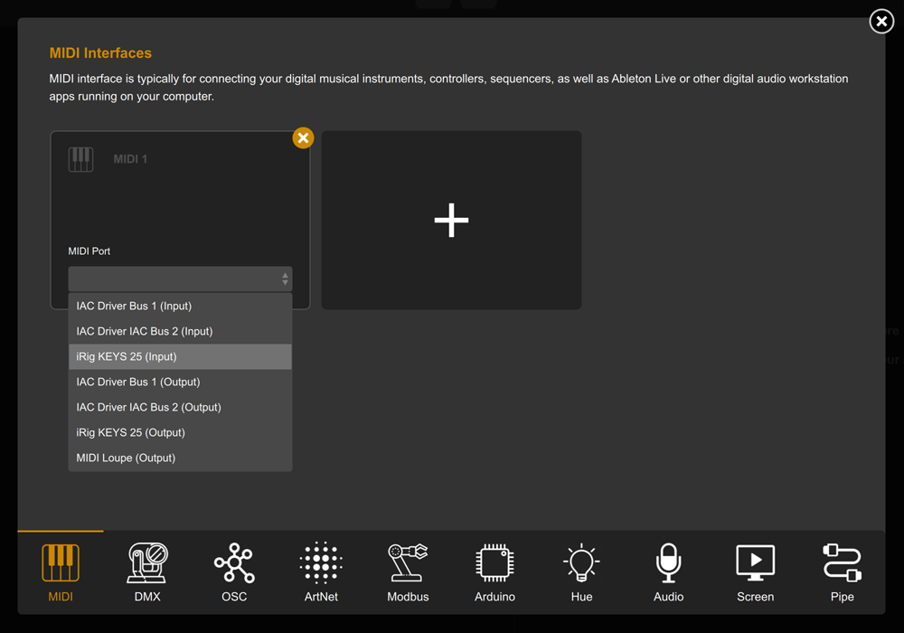
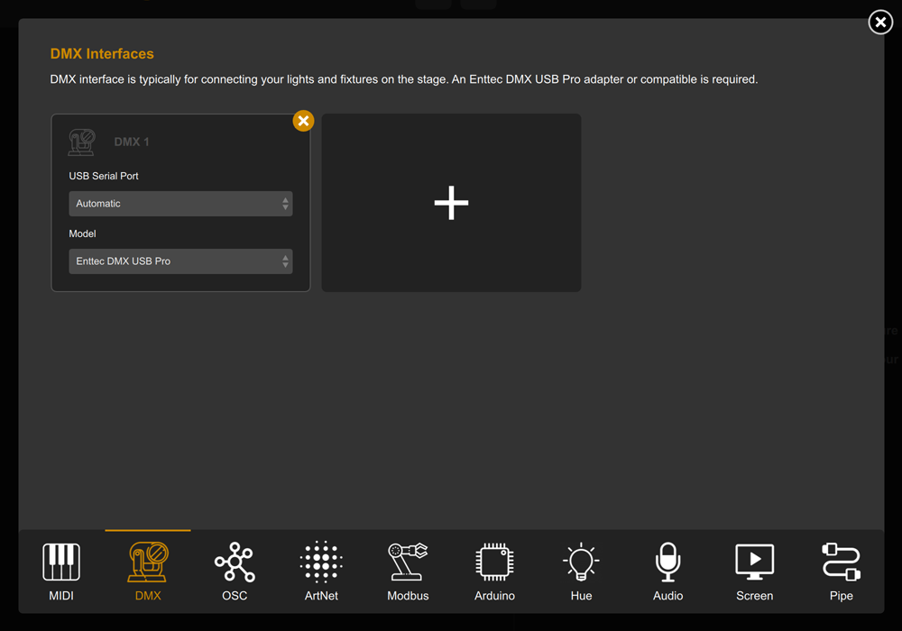
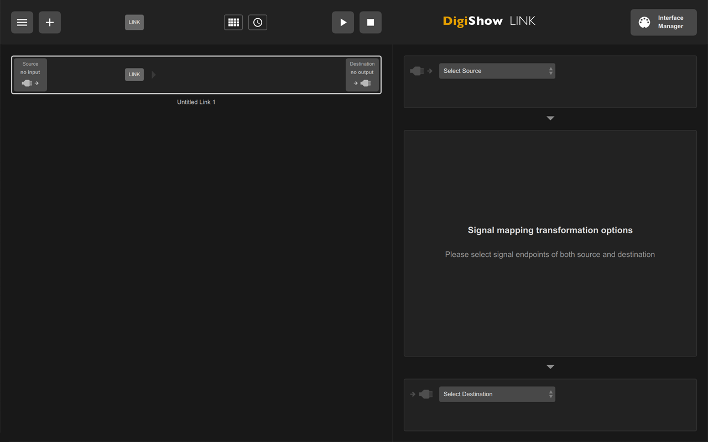
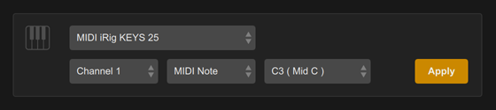
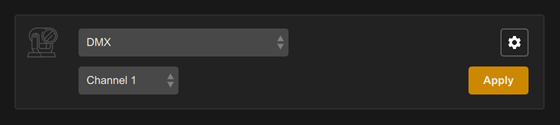
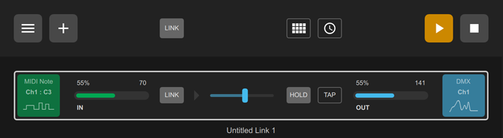
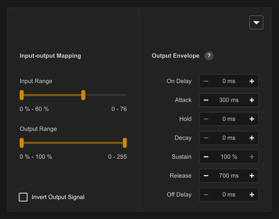

# DigiShow 入门指南：将 MIDI 音符映射到 DMX 灯光通道

1. 让我们开始使用 DigiShow。将 MIDI 键盘和 ENTTEC DMX USB Pro 适配器连接到电脑的 USB 端口。ENTTEC 适配器用于连接 DMX 灯具。 

2. 打开 DigiShow LINK 应用程序，点击窗口右上角的“Interface Manager”（接口管理器）按钮。 

弹出“Interface Manager”对话框，选择“MIDI”选项卡，点击“+”按钮创建标记为“MIDI 1”的新接口配置，然后在此处选择您的 MIDI 键盘型号。 

选择“DMX”选项卡，点击“+”按钮创建标记为“DMX 1”的新接口配置。完成后关闭“Interface Manager”对话框。 

3. 现在，我们尝试创建一个信号链接，将您的 MIDI 键盘输入连接到 DMX 灯具输出。点击窗口左上角的“+”按钮，左侧列表中将添加一个空白链接项。同时，您需要在右侧为该信号链接设置输入信号来源、输出信号目标以及映射变换参数。 

4. 点击“Select Source”（选择信号来源）下拉菜单，选择您的 MIDI 键盘，然后将输入参数设置为“Channel 1”（通道 1）、“MIDI Note”（MIDI 音符）、“C3”，并点击“Apply”（应用）按钮。 

点击“Select Destination”（选择信号目标）下拉菜单，选择“DMX”，将输出参数设置为“Channel 1”（通道 1），然后点击“Apply”（应用）按钮。 

5. 点击顶部栏的“▶︎”按钮，启动信号链接会话。此时，当您按下 MIDI 键盘上的 C3（中央 C）键时，DMX 通道 1 上的灯光变化将被同步触发。 

6. 修改“Input-out Mapping”（输入输出映射）和“Output Envelope”（输出包络）中的设置，实时改变映射变换的效果。例如，将“Attack”（渐入）设置为 300 毫秒，“Release”（渐出）设置为 700 毫秒，可使灯光淡入淡出。 

7. 按照此方法添加更多信号链接。 

获取更多学习资料, 请访问 [digishow.cn](https://cdn.digishow.cn) 